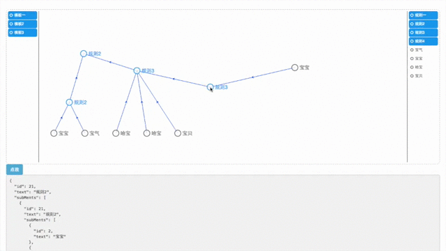

# d3-risk-rule
***
## 说明:

公司内部为实现一种统计规则的视图化定制,实现的一个规则编辑视图,有点类似于思维导图,
可由结构数据生成视图,视图可编辑,视图可生成结构数据.

## 构建:

webpack

webpack --config webpack.build.js

## demo

https://weivea.github.io/d3-risk-rule/

gif太模糊啦,话说有人知道这种清晰制作屏幕截图动态图的方式么?知道的话请发邮件到550281353@qq.com,万分感谢:)
